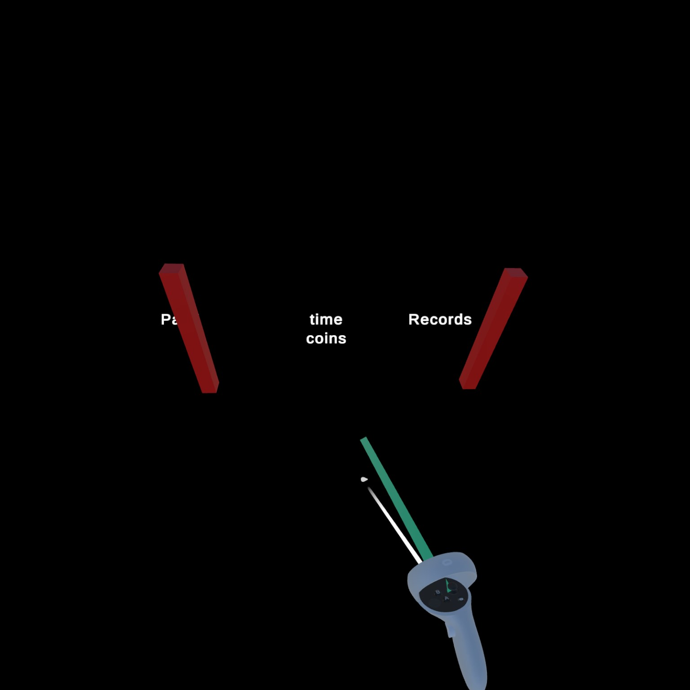
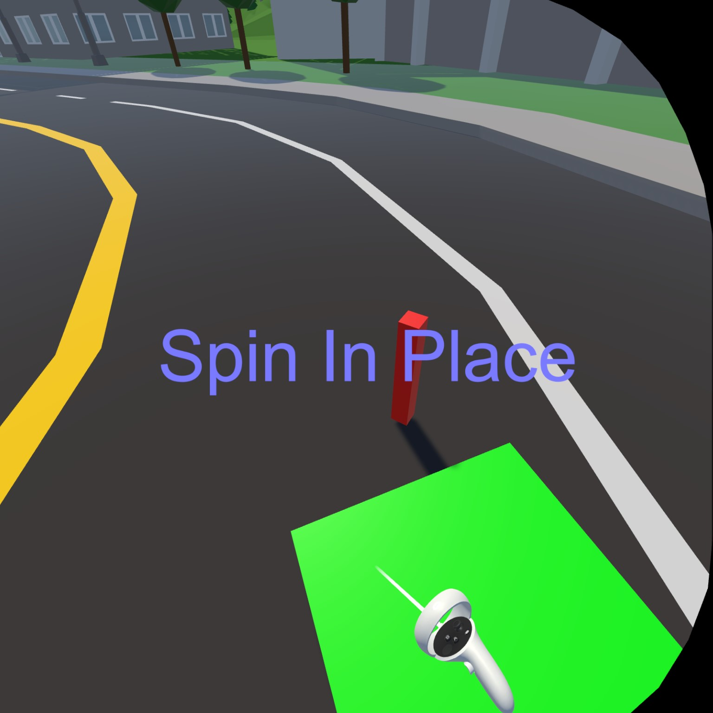
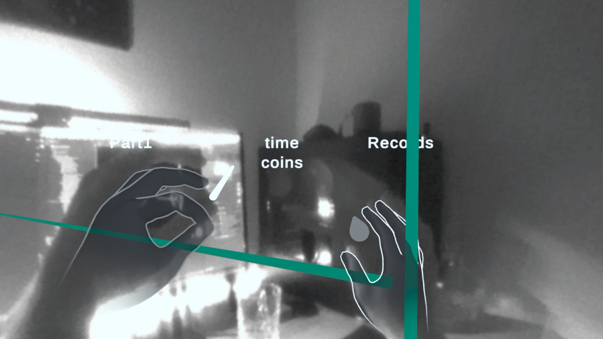
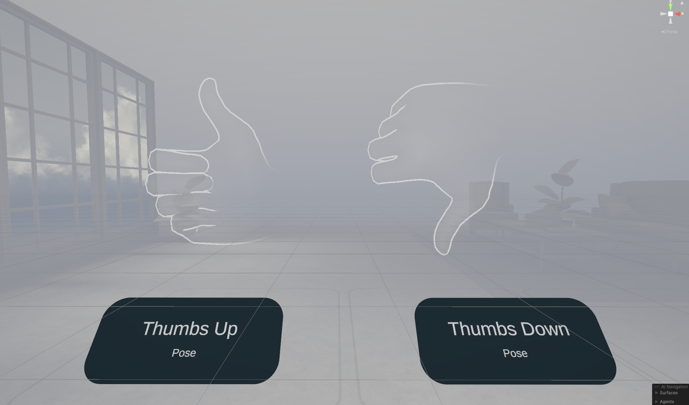

Once I had settled on redirected walking, I needed a way to track my players position in the physical space and even before that get an idea of what their physical space looks like.
And every VR headset already has that in the form of a boundary so you don't wander off into walls or worse TVs, right?

## Guardian Boundaries
Well, it's not that simple.
I tried extracting the guardian boundaries through the Meta SDK.
```C#
boundary = OVRManager.boundary;
points = boundary.GetGeometry(OVRBoundary.BoundaryType.PlayArea);
```
It kind of looked like this:

Or they looked like this after I placed red cubes on their vertices.
However, these "boundaries" weren't really the boundaries I was looking for.
They were static, not relating to my shifts in the virtual world.
And they weren't really the guardian boundaries of my Meta Guardian - they were waaay smaller.
Might have had to do with my getting the `PlayArea` instead of the `OuterBoundary` but overall I had problems getting a consistent area.
Even though I didn't change my boundaries AT ALL in between tries, sometimes I'd just get different borders, more than once obviously outside my actual boundaries.

At this point I gave up on automatically setting the borders and made it the player's problem.

## Floor Markers with Controller
I started with the simplest thing I could come up with.
The player takes a controller, points to the floor, shoots to place a marker, and presses a different button to signal he has placed enough markers.
Easy right?
Meta's controllers even have a ray cast built in, with visualization and everything.
Long story short, I didn't manage to just use Meta's ray cast.
It's probably easy, **if** you know how it's done.
To this day, I don't.
So I did the next best thing.

```C#
Ray ray = new Ray(controllerPosition, controllerRotation * Vector3.forward);
UnityEngine.Plane plane = new(groundPlane.up, groundPlane.position);
        
bool result = plane.Raycast(ray, out float hit);
var rayHit = ray.GetPoint(hit);
UpdateLaserPointer(controllerPosition, ray.direction, result, rayHit);
``` 
I calculated a ray forward from the controllers position and checked, whether it hit the ground or not.
If it hit, I had the ray end there.
Otherwise, the ray would just go on for roughly ten meters.
To display the ray, I used a simple line renderer.
On pressing the trigger button (while hitting the plane) a little sphere would mark the spot.
All of this together looked a little like this (I had still left the guardian markers in):


On pressing `B` you'd confirm your selected area. But how do I choose what the area is based on the markers?

### Largest Interior Rectangle
Well, for some reason I wanted the area to be a rectangle.
Therefore, I at least calculated the largest interior rectangle within the polygon created by the markers (because you're able to add more than four).
I mean, I didn't calculate it personally but used [lir](https://github.com/Evryway/lir), a C# implementation for calculating the largest interior rectangle. 
I displayed the selected area as a green plane.


---

I used this setup for testing during most of the development.
Until I came back and reworked it a little to be more in line with my paradigm of *free exploration*.

## Floor Markers with Hand Tracking
I started by replacing the controller with my tracked hand.
This brought up a unique set of challenges.
Firstly, where does the ray come from?
And secondly, how do I press a button when I have no buttons?

Well, excellent questions.
For the first question, I realized that with hand tracking *forward* was a little different.
More specifically, forward is along the direction of the fingers.
So I chose to have the ray start in the palm of the hand - similar to a mage's fireball (even though it is just a marker sphere).

For the second question, I chose to do a little pinch - with the **other** hand.
This decouples the aiming from the *button* press, making it more precise.
I also added a little coroutine imposing a cooldown of .3 seconds on this gesture.
This prevents the user from placing markers in rapid succession.

To make it more visible that the user was pinching, I made the right hand glow a little more profoundly when the left index and thumb were pinched, as you can see in the image.

## Floor Markers with Invisible Hand Ray Cast
Finally, I decided to remove the ray all together to make it feel even *freer*.
To indicate the intersection between the now invisible ray and the ground plane, I placed a slightly less pronounced sphere that followed the intersection.

Now it was like viewing the preview of a fireball before placing it.

## Gestures as Button Input
I still needed a new `B` button.
So I fell back to some of Meta's pre-implemented gestures.
In particular, I used the thumbs up and down, both on the left hand.
I used the thumbs up as a substitute `B` to confirm the selected area.
And I finally added the ability to discard all the markers placed so far and start anew with a thumbs down.

Overall these gestures were much easier to implement than anticipated.
But then again, I relied on the reference implementation provided in Meta's `PoseExample Scene` in the Interaction SDK.
Still, it for a simple gesture like a thumbs up you need **three** individual components.
Probably, due to modularity but still - that's some overhead.
