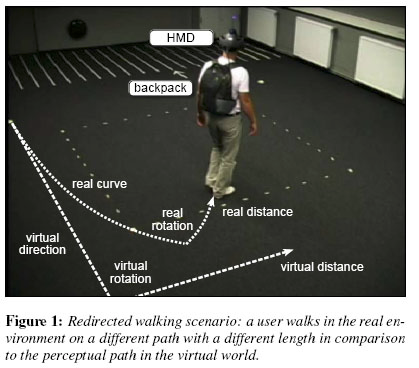

So after the first few lectures and extensively browsing through the [Locomotion Vault](https://locomotionvault.github.io/), redirected walking caught my eye.

## Redirected Walking
Redirected walking utilizes visual dominance to overwrite the perception of walking in a straight line by (potentially imperceptibly) shifting the visual world.
The user compensates for these slight shifts by adjusting their direction, resulting in an altered trajectory.

Basically, if done right, with redirected walking you can make someone walk anywhere you want (within limits if you want to be imperceptible).
The idea spoke to me, because it gives the user the freedom to explore on their own, seemingly unrestricted by their physically available space ...

## Physical Space Restrictions
... however, I wanted it to work in the space available to me.
To use imperceptible redirections you're space requirements are in the ballpark sizes of a small gym - I roughly had ONE whole square meter.
So imperceptible was out.
But as long as I adjust the values enough, it is perceptible but should still work, right?
Well, that was enough to convince me, so I took on the challenge of getting redirected walking to work within all of one square meter.

## Overall Theme
For the overall theme, my idea was to have my players become a wizard, floating over an abyss.
[comment] ADD image from presentation
So basically drop away the street of the provided parkour.
To move I imagined the player to point where they wanted to go and raise ethereal bridges to go there - the bridges conveniently just as long as the diagonal of the available play space.
[comment] ADD other image from presentation
My idea was to place the bridges in such angles to one another, that I would be able to redirect the user where he wanted to go.
I'm still convinced that it would make a killer theme for a VR game.
However, it's not quite where I ended up ... so keep on reading to find out!