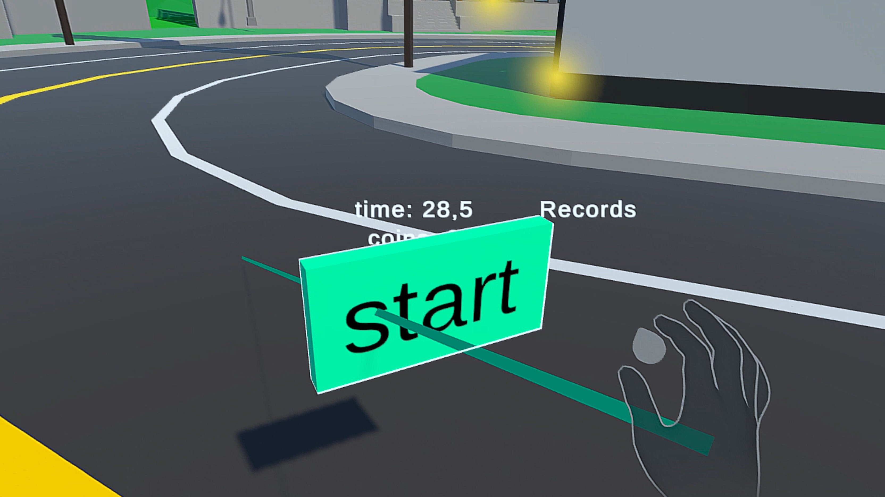

For my interaction technique, I wanted to stay within my paradigm of *free* exploration.

## Controllerless Interaction
Therefore, I chose a controllerless interaction scheme.
I chose a ray cast derivative.
It consists of two individual components - the ability to point and the ability to select.
For pointing, I chose a ray emanating from my right palm (because I'm right-handed).
For selecting, I chose the pinch of the left index and thumb (because it was pre-implemented by Meta).
Together, this looks something like this:

To emphasise that you're currently selecting something, I highlighted the hand model with a distinct white glow.
(To be completely truthful, I designed my interaction before adjusting the play area selection to use the same, but these entries need some kind of chronological order.)
In the final implementation I removed the ray display, to further stress the *free* exploration.

## Gestures
Before I settled on the pre-implemented pinch, originally I used a L-shape formed with the right index and thumb to select.
To achieve this I used the hand skeleton and calculated the angle between index and thumb.

However, this had multiple drawbacks.
Firstly, the hand skeleton had to be initialized to be used.
Initially, this took between three and thirty seconds.
Now I assume that the system needs to see both hands to initialize the hand skeletons.
Because when I held the headset with one hand to just quickly check something, the initialization took forever.
When wearing the headset this was significantly faster.
Secondly, the detection of the gesture wasn't as resilient as I had hoped.
I had to overflex my thumb to get it to detect, and sometimes it would undetect because of bad hand tracking.
Thirdly, because I added it to the same hand as the one casting the ray from, each time I made the gesture I jiggled my ray.
Initially, I didn't think it would be a big deal.
However, while testing I frequently missed the mark from further away, since a slight jiggle in the ray propagates in relation to the distance of the ray traveled.

```C#
if (leftHand.GetFingerIsPinching(OVRHand.HandFinger.Index) &&
    leftHand.GetFingerConfidence(OVRHand.HandFinger.Index) == OVRHand.TrackingConfidence.High)
{
    handMeshRenderer.material = selectMaterial;
    if (hit.collider != null)
    {
        InteractWithObject(hit.collider.gameObject);
    }
}
else
{
    handMeshRenderer.material = unselectMaterial;
    // drop t
    if (selectedObj != null)
    {
        selectedObj.transform.parent.transform.parent = null;
        selectedObj = null;
    }
}
```
Therefore, I switched to Meta's pre-implemented pinch and placed it on the left hand.

## Object Highlighting

To make it clear, what object I'm currently interacting with I chose to highlight the current object.
My first idea was to just make the material of the selected object emissive.
I started out, wrote a script, tested it, and shelved it because I just couldn't get it to work.
Then I just added a [pre-implemented outline script](https://assetstore.unity.com/packages/tools/particles-effects/quick-outline-115488) from the asset store - and everything worked like a charm.
And what did I learn from this experience?
Maybe next time I'll spend a little more time on trying to find a pre-implemented version of the thing I want instead of just starting to implement it myself.
