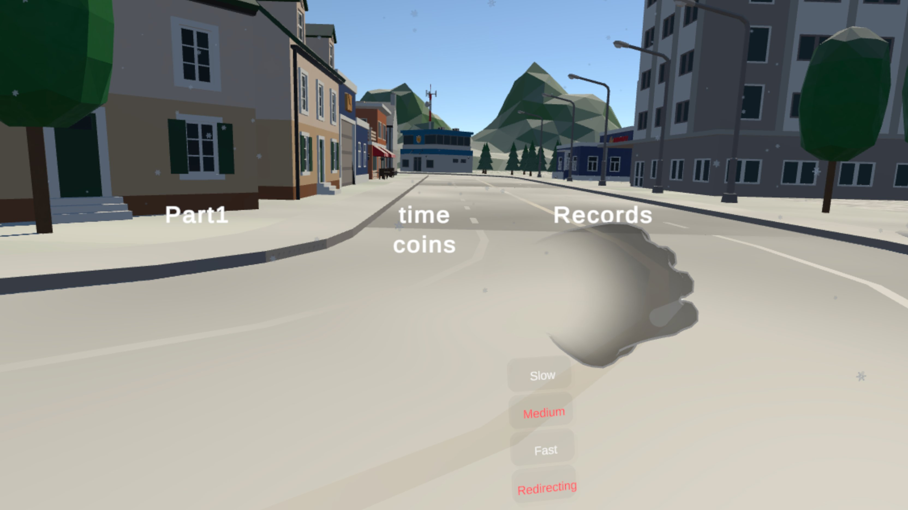

As teased in my last entry, I faced the challenge that of my redirected walking only the resetter worked, barely.
Upon discussing this with my peers and my professor, it was suggested to try to make this a mechanic - and that's exactly what I did.

## Spin to Win
I realized that I could just use the resetter as the locomotion mechanic.
To be able to transverse the parkour, I thought of giving the player a little push.
I ended up with a version whereupon completion of the turn a velocity was added to the user, catapulting him forward so he would slide similar to ice skating.


This has the advantage that the initial acceleration is masked by the user's turning.
For your understanding, disparities in the perceived visual acceleration and the acceleration perceived by the inner ear can lead to motion sickness.
By still feeling the acceleration of the turn, the sudden burst is masked by this.
However, for slowing down again, I didn't come up with anything similar, unfortunately.
I also had to make a few more decisions to make this a viable game mechanic.

### Linear Movement Directions vs. Gaze Controlled Directions
Initially I thought of the push as a force acting upon the user in the angle he finished his resetting.
```C#
var resultingTransform = Vector3.zero;
foreach (var v in velocities)
{
    resultingTransform += v.Direction * (v.Velocity * Time.deltaTime);
    v.Velocity = v.Velocity > 0 ? v.Velocity - GroundFriction : 0;
}
velocities.RemoveAll(v => v.Velocity == 0);
transform.position += resultingTransform;
```
However, this ended up being extremely hard to control.
Especially finely modulating the angle one would be accelerated upon finishing the rotation.

The other approach I tried and eventually settled on were gaze controlled directions.
Here, the force is always in the direction the user is currently looking (in the xz-plane).
This allows for directional control by shifting ones gaze.
However, especially at high speeds turning the head made me quite nauseous.

### Dynamic Field Of View
To alleviate this I used a [cybersickness reduction technique](https://github.com/angsamuel/GingerVR), specifically a dynamic field of view.
At higher speeds the field of view is reduced, limiting peripheral vision which is known to reduce motion sickness.
I eyeballed the speed necessary to create this reduction, but I had the feeling it helped - especially at high speeds.


## Wristwatch
I wanted the user to be able to select from different speeds to travel at.
In particular, I wanted to allow fast travel over large distances and more fine-grained movement in tight spaces for precision.
Therefore, I needed a way to switch between these modes.
For this I came up with the metaphor of a wristwatch on the left hand.


It consists of pokable panels I modeled after Meta's reference implementation for their Interaction SDK.
They are a little under the wrist, hanging from it so to speak, to be able to poke them without poking ones own arm and to reduce self occlusion of ones hands.
The watch is only displayed if the user has his wrist turned towards him - as if looking at a wristwatch to check the time.
```C#
var handToHeadDirection = (headTransform.position - leftHandTransform.position).normalized;
var angle = Vector3.Angle(leftHandTransform.up, handToHeadDirection);
selectorUI.SetActive(angle <= AngleThreshold);
```
The different levels slow, medium, and fast correspond to the speed ranges of \[3, 5\], \[8, 10\], and \[12, 15\] respectively.
These values were produced by trial and error.
Even though they are not in a specific unity, they're linear to one another.

I also added a button to toggle the spin redirection, because I found that especially when interacting, it is easy to wander a little out of the play area and the resulting command to spin can be quite annoying.

## Collisions (or the lack thereof)
Finally, I tried my luck with collisions, however with limited success.
After a lot of trial and error, I finally gave up on most collisions, after changing the colliders of multiple buildings back to non-convex and making them static objects.
So now some collisions work, especially when hitting the interaction start or done button.
However, in that case the physically tracked area can still slide a little, miss aligning it with the real world and complicating the interactions thereafter.
Unfortunately, I didn't have the capacities to fix this in the final version.
