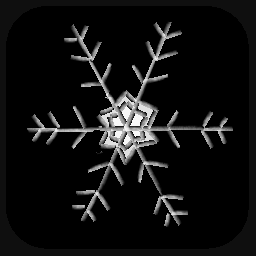

Finally, it was time to make my game look like an actual game.
Since my locomotion remotely resembles ice skating I went with a winter theme.

## Snow Shader
Naturally, my first association with winter is snow.
So I added a snow shader.
I found a nice [tutorial](https://github.com/daniel-ilett/shaders-snow-layers) and followed it to build the appropriate shader graph.

However, to do this I had to upgrade the project to Unity's Universal Render Pipeline.
Fortunately, Unity provided a guide on how to do this.
Nonetheless, I had to reimport TextMeshPro (which to be honest happened more than once over the course of the project).
Also, this shader is not a post-processing shader and therefore has to be applied to each material individually it is supposed to affect.

Because the shader allows to set the snow amount, I added a little script to shift the landscape to snow over the first few seconds the player is on the parkour.

## Snowflake Coins
Next, I replaced the coins with snowflakes, which seemed more appropriate to me.
To do this, I created a CAD model of a snowflake in SketchUp and converted it to a `.obj`.
Then it was rather simple to change the coin prefab to a snowflake, automatically replacing all the coins with snowflakes at once.

## Winter Soundscape
To make it feel even more like winter, I changed the soundscape as well.
The first thing was to replace the background music - a soundtrack I've grown to feel annoyed at over the project.
Instead, I opted for a free [winter loop](https://freesound.org/people/AudioCoffee/sounds/770696/).
This already felt significantly more festive.

But the other thing I changed was the coin collection sound.
Since the coins weren't coins anymore but snowflakes, I chose a short sample of [ice cracking](https://freesound.org/people/wwstudioswastaken/sounds/624163/).
Together, the parkour instantly felt way more like a winter experience.

## App Icons & Splash Screens
Finally, to complete my winter attire, I designed fitting app icons and a loading splash screen.+
I started with the splash screen and christened the project *VR-Redirected-Winter*.
I also added a little snowflake as the part of the design

For the app icons I chose to only use the little snowflake and had the individual resolutions required for an app icon [generated](https://romannurik.github.io/AndroidAssetStudio/icons-launcher.html).
