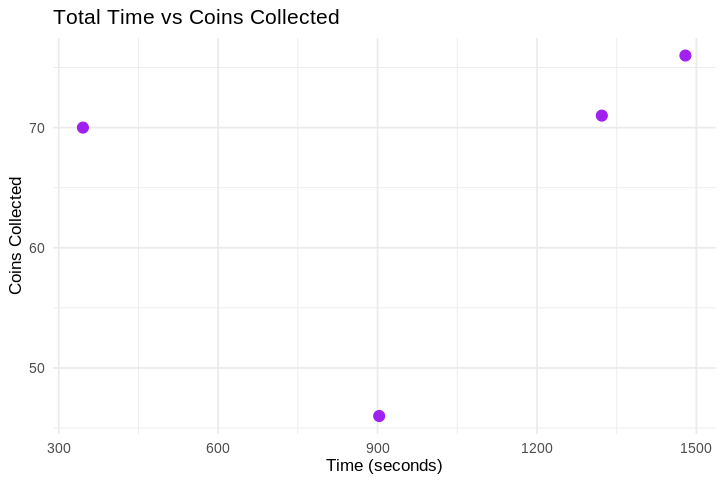
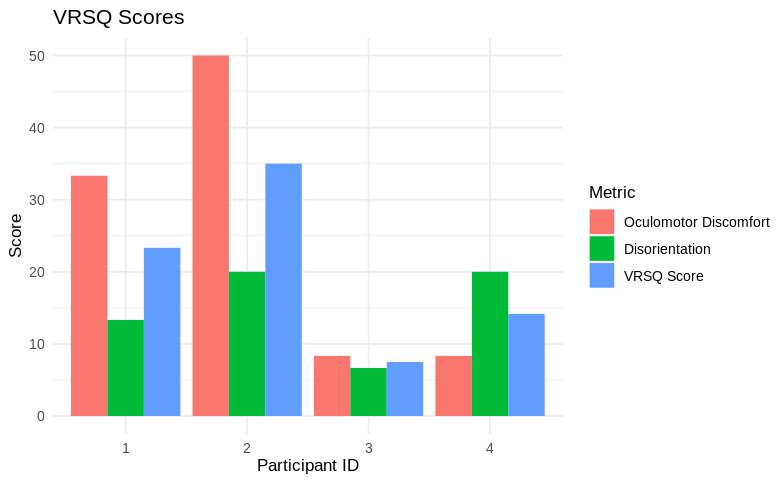

Testing my final project state was fun.
But it was even more fun watching my friends test it (and hoping they would still be my friends afterward).

## General Observations
So overall, I found that my experience with the system gave me a huge advantage over my friends, allowing me to complete the tasks way faster.
I also noticed, that the reset gesture with the thumbs down was often triggered on accident when trying to switch between speeds.
That led to some frustration, but was pretty fun to observe from the outside.

After a short period I also noticed that it is way more fun when I'm able to see what my friends can see.
So I started streaming their view from then on.

As metrics to evaluate my work against, I chose the completion time, the score next to it, and the [Virtual Reality Sickness Questionnaire (VRSQ)](https://omb.report/icr/202012-0920-016/doc/107354700).
The VRSQ is specifically designed to allow for judgements on ones disorientation after VR experiences and I chose it, because my locomotion technique messes with your sense of your physical orientation.
It is made up of the average of two individual scores - one for oculomotor discomfort and one for disorientation.
Oculomotor discomfort refers to issues related to eye movement and visual perception.
In this context, disorientation refers to a sense of spatial confusion or loss of balance.

## Facts & Figures

Overall, my own score falls heavily out of the range established by my three friends.
It took them between fifteen and twenty minutes to complete the parkour, while I only took roughly six.
Therefore, further work could look into whether experience with the system makes it easier to use or if I just have an advantage because I built it.

The more fine-grained control was good though.
Collecting snowflakes worked well and the (close-ranged) interaction was surprisingly accurate.

But overall the more interesting metric is the VRSQ score.
As you can see, the oculomotor discomfort score was often higher than the disorientation score.
This surprised me, because I thought my locomotion technique would be pretty disorienting.
But apparently the visual representation was often more taxing.
This might be due to the performance my shader takes.
Or the strain streaming the video feed put on the headset.
Therefore, looking at the performance in detail and then taking a second look at the oculomotor discomfort scores could be a good area of improvement.

In general, the scores are all pretty low.
The VRSQ and its partial scores are measured on a scale of 0 to 100.
With the highest overall score clocking in at 35 and an average of 20, I think my locomotion is a success.
But since a study with only four participants isn't that meaningful, further work could go into repeating the experiment with more participants. 
