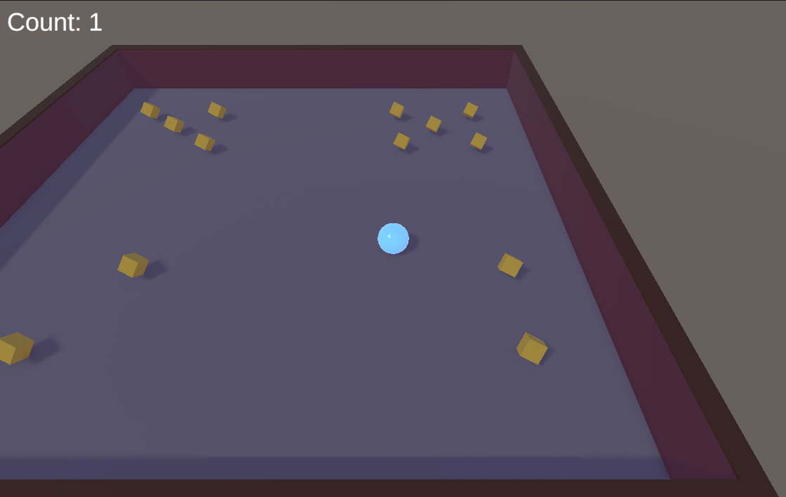
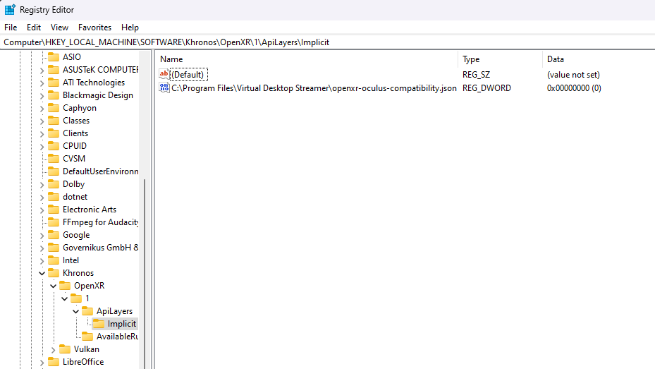

This is a little rambling about the setup process of Unity and the Quest followed by the implementation of Roll-a-ball[^1].

## UnityHub (or it doesn't work on my machine)

So due to my setup I basically tried to work with Unity on my Ubuntu operating system.
It started harmlessly enough with the linux-typical download using `apt-get` to install the UnityHub.\
So far so good.\
I installed the editor with the android built tools.\
So far so good.\
I downloaded the correct template.\
So far so good.\
I created a new project from it and opened it.\
So far so good.\
Took forever to load, but I thought "oh well, my PC is just getting old".\
So far so good.\
It's done loading and my whole system crashes.\
Oh well, just restart and try again.\
Same story.\
Uninstall and reinstall.\
Same old, same old.\
I tried installing an older version, got exactly as far es before but with one crucial difference: It generated an error report!\
As the highly skilled computer science professional that I am I just submitted it as a bug report and immediately forgot about it.
A day later I got a mail from the Unity staff responding to my bug report.
So it turns out it wasn't a bug but my system was using the wrong Nvidia drivers.
One could have read that from the error messages - or so they said.
Well, I installed the correct drivers and just like a miracle the editor actually opened (with another error message but at least it opened, and you could just ignore it).
However, on creating a new scene I just got a blank window to choose the scene template.
So I decided to give in and switch to Windows.
I changed operating systems and installed UnityHub a second time.
That worked and I had my first empty Unity project!

## Roll-a-Ball the first

Since I've never worked with Unity I decided to start with Hello World, or Roll-A-Ball as it is called in Unity.
You can find it at the Unity learn platform[^1].
Well I just followed the tutorial and it was pretty straight forward.
The editor felt kinda familiar anyway, since I have worked with quite a lot of CAD software, e.g. in creating 3D prints.
So implementing the whole tutorial went smoothly and I added a glass pane on top of the playing field to prevent the ball from falling off the game board.
Also, I changed the material of the ball and made it glow.

## Meta Quest Setup

Only implementing the game in 3D would be boring, especially since the goal is to create a VR/AR application.
So I started on the setup of my Meta Quest 2.
Since the last user had just returned it, I googled and applied a factory reset.
Next I linked it to a Meta account and completed the setup process.
Everything went smoothly.
I also installed the Quest Link, which also worked right out of the box.
Except for ...

## OpenXR default runtime

... the OpenXR runtime.
When starting a VR application in Unity it wasn't displayed on the Quest and the Quest Link complained about not being the default OpenXR runtime.
So I pressed the dedicated button to fix this - and nothing happened.
I started the Quest Link with administrative privileges - and still nothing.
A quick google search later I started editing the registry entries.

Since I had another VR headset installed previously, it was set to SteamVR.
So I tried to change the registry entries by hand but must have gotten something wrong, because in the Quest Link now None was the default OpenXR runtime.
Before I changed even more registries, I wanted to try something I probably should have tested before changing registries.
I logged into my admin account (because I have a separate user with administrative privileges) and started the Quest Link.
I had to go through the whole Quest Link setup process again, but once done I could click the button to set the default runtime.
The takeaway of this story is that the Quest Link apparently wasn't designed to be operated on an account without admin rights.

## Roll-a-Ball the second - now in VR

After this slight hick-up I went back to my Roll-a-Ball and added VR capabilities to it.

Just following our provided tutorial it worked pretty great.
The only issue I had was that sometimes the ball clipped through the board and fell down.
That was rather annoying, but I attributed it to the ball moving to fast and then just "skipping" through the collider so to speak.
Next I wanted to deploy my app to my Quest.
However, for some unknown reason Unity wasn't able to find the Android SDK.
So after a reinstall of Unity with the Android built tools (which I had installed the first time also) I tried again and it worked.
I had my very first own VR application now running stand-alone on the Meta Quest.

[^1]: https://learn.unity.com/project/roll-a-ball
